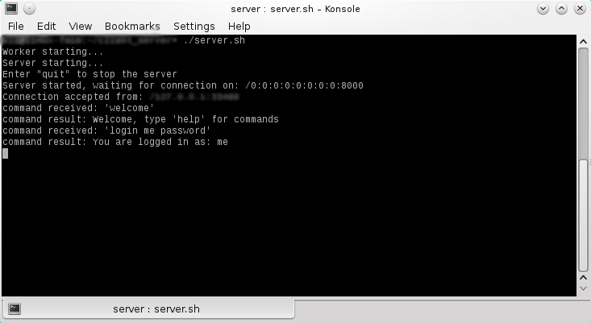
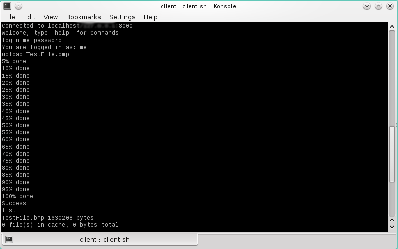

# client-server
Client-Server console application.

### Built with: 

	- Java NIO as well as Standart I/O
	- Java Reflexion API 
	- Server administration with Remote Method Invocation (RMI)

The Server uses the Non-blocking or New Input Output(NIO) to handle incoming connectons. 

The Reflexion API is used for loading a plug-in which logs the user's interaction with the server in a log file.

### The Remote interface provides methods for:
  - deleting registered users
  - changing user passwords
  - listing registered users

### Server features:
  - user managment (register,login,logout)
  - uploading/downloading files 
  - sending messages to all users connected to the server
  - listing all the files that are currently on the server

The source files are included in their respective folders.

## Screenshots

## How to run the application
1. Run the 'rmi_server.sh' executable to start the RMI server
2. Then run 'server.sh' to strat the server
3. Run 'client.sh' to connect a client to the srver(You can execute "client.sh" more than once for multiple client connections)
4. (Optional) For the remote administration features run 'admin.sh' with one of the following options:
  - 'delete' <username> (to delete an existing user) 
  - 'chpass' <username>  <new password> (to change the password of an existing user)
  - 'list' (to list all registered* users)
  
*Note that the serever automatically registers new users on the first login with the provided credentials.
